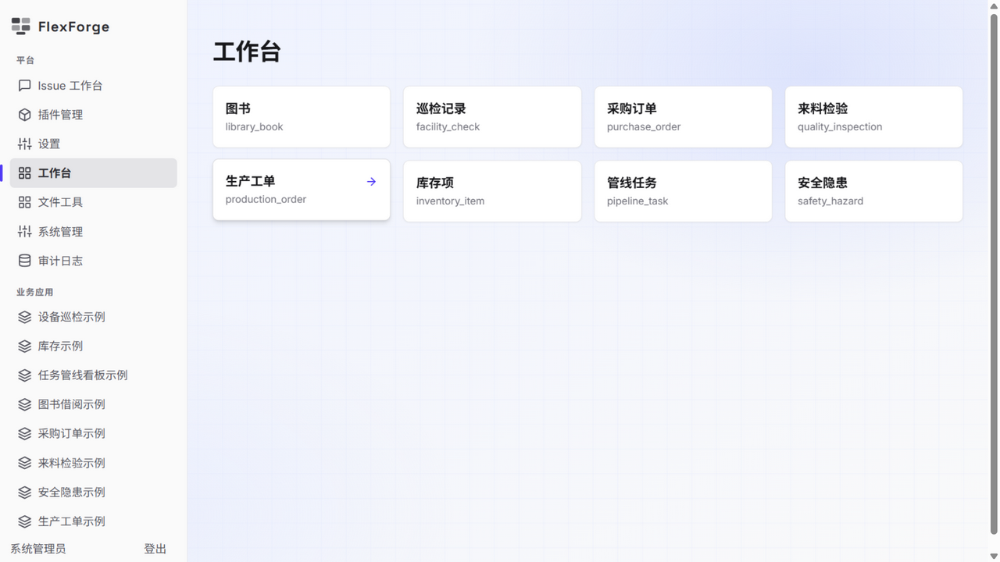
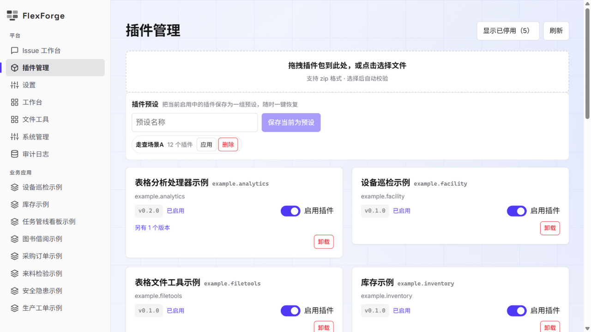

<div align="center">

# FlexForge

**A metadata-driven, plugin-extensible data management platform.**

Define your data model once — get CRUD pages, workflows and dashboards for free.
Extend everything with plugins: entities, views, themes, languages, data processors.

[](https://github.com/KuroNeko-night/FlexForge/actions/workflows/ci.yml)
[](https://vuejs.org/)
[](https://www.typescriptlang.org/)
[](https://vite.dev/)
[](https://spring.io/projects/spring-boot)
[](https://openjdk.org/)
[](https://www.postgresql.org/)
[](https://flywaydb.org/)
[](https://www.docker.com/)
[](https://vitest.dev/)
[](https://testcontainers.com/)

[Getting Started](#getting-started) · [Features](#features) · [Screenshots](#screenshots) · [Tech Stack](#tech-stack) · [Architecture](#architecture) · [Documentation](#documentation)

**English** | [简体中文](./README.zh-CN.md)

</div>

---

## What is FlexForge?

FlexForge lets a small team run business data without hand-writing pages:

- **Admins** define entities and fields in the Data Model page — list / create / edit / detail pages, table & kanban views, validation and CSV/XLSX export are generated at runtime.
- **Developers** package metadata, views, themes, language packs and Python data processors as versioned plugins, activated with dependency checks and reversible uninstall.
- **Users** describe needs in a chat workspace; an AI assistant (offline fixture, or any OpenAI-compatible API such as DeepSeek) shapes them into validated specs, from which a reviewable plugin skeleton is generated.

The platform itself stays neutral: themes and languages ship as plugins too, and every UI language of the interface (English, Japanese, French, Spanish on top of the Chinese baseline) is just another package you can toggle.

## Screenshots

| Workbench | Plugin Management |
|:---:|:---:|
|  |  |

## Features

- 🧩 **Declarative plugins** — Level 1 packages declare resources only (navigation, entities, views, migrations, themes, locales, presets); Level 2 packages add sandboxed Python data processors (table → table / chart / file artifacts).
- 🗂 **Metadata-driven CRUD** — runtime-generated pages for every entity, no per-entity page code; table and kanban presentations; paged queries over JSONB with parameterized, whitelisted SQL.
- 🤖 **AI requirement pipeline** — chat-based clarification → schema-validated structured spec → plugin skeleton preview & generation; manual review before activation by design.
- 🎨 **Themes & i18n as plugins** — default and warm themes; four language packs (352 keys each) over a Chinese baseline, falling back automatically when disabled.
- 🔐 **Security-first** — JWT + role-based access (ADMIN / DEVELOPER / USER), full audit log, batch user operations, plugin packages fully validated at import, processors sandboxed with stripped env / byte caps / hard timeouts.
- 🩺 **Upstream-aware AI config** — model endpoints are probed (`GET {base}/models`) before saving; outbound URLs are guarded against loopback/private/reserved addresses.
- 📊 **Charts & file tools** — token-palette Chart.js rendering and file in/file out processors exposed on dedicated tool pages.

## Getting Started

### Run with Docker

```bash
cp .env.example .env          # set AUTH_JWT_SECRET and a bootstrap admin password
docker compose up -d --build  # PostgreSQL 17 + backend + frontend

curl http://127.0.0.1:8088/actuator/health   # expect {"status":"UP"}
```

Then open **http://127.0.0.1:5173**, sign in with the bootstrap admin, and drag plugin packages from the [`plugins/`](./plugins) directory into the **Plugins** page to import the demo apps, themes and language packs.

### Run locally

```bash
# backend (Spring Boot, port 8080 by default)
cd backend && ./mvnw -pl flexforge-app -am spring-boot:run

# frontend (Vite dev server, proxies to the backend)
cd frontend && npm ci
VITE_PROXY_TARGET=http://127.0.0.1:8080 npm run dev
```

### Tests & checks

```bash
cd backend && ./mvnw verify                 # unit + Testcontainers integration tests
cd frontend && npm run test                # Vitest component/unit tests
node scripts/check-repo-health.mjs          # full local gate, same as CI
```

## Tech Stack

| Layer | Choices |
| --- | --- |
| Frontend | Vue 3.5 · TypeScript 5.9 · Vite 8 · Vue Router · Chart.js 4 · self-hosted fonts (no CDN) |
| Backend | Java 17 · Spring Boot 3 · Spring Security (JWT) · JdbcTemplate · Flyway |
| Database | PostgreSQL 17 (JSONB dynamic record storage) |
| Plugin runtime | Declarative JSON manifests · zip packages · Python 3 subprocess sandbox (Level 2) |
| Quality | Vitest · JUnit 5 · Testcontainers · ESLint/Prettier · Checkstyle · GitHub Actions CI |
| Delivery | Docker Compose · GitHub Actions image build |

## Architecture

Modular monolith — one deployable Spring Boot app, one Vue 3 SPA, one database, with strict internal module boundaries:

```
backend/
  flexforge-common    cross-cutting API (audit port, errors)
  flexforge-auth      JWT auth, roles, user management, batch ops
  flexforge-meta      metadata entities/fields/views
  flexforge-data      record query/write over JSONB (parameterized, whitelisted)
  flexforge-plugin    package import/validation, activation lifecycle, presets
  flexforge-runtime   frontend-facing asset registry (signed URLs, themes, locales)
  flexforge-issue     issue workflow, AI clarification, spec revisions
  flexforge-ai        model ports (fixture/http), prompts, spec schema, generator
  flexforge-app       assembly: controllers, filters, exception mapping

frontend/
  src/registry/       menu / renderer / theme / locale / layout / record-action registries
  src/components/     renderers, workbench, issue workspace, plugin & admin UI
  src/views/          route views (workbench, data model, plugins, users, audit, tools…)

plugins/              example business apps, themes, language packs (Level 1/2)
database/migrations/  Flyway baseline — plugins carry their own migrations
```

All extension surfaces are registered in the [extension-point registry](./docs/extension-points.md) and validated at import; unknown contributions are rejected.

## Status

Initial development complete (`v0.1.0`) — all planned features delivered and covered by tests, under maintenance. See the [docs](#documentation) for design details and [STATUS.md](./STATUS.md) for the development log.

## Roadmap

- Dark theme and theme editor
- Open plugin package format documentation for third-party authors
- More language packs and community translations
- Deployment hardening guide (TLS, external PostgreSQL)

## Documentation

- [Requirements](./docs/02-requirements.md) · [Architecture](./docs/03-architecture.md) · [Test strategy](./docs/04-test-strategy.md)
- [Plugin runtime data model](./docs/07-plugin-runtime-data-model.md) · [Extension points](./docs/extension-points.md)
- [Security baseline](./docs/13-security-baseline.md) · [Engineering governance](./docs/10-engineering-governance.md)
- [Project plan](./docs/01-project-plan.md) · [Implementation stages](./docs/09-detailed-implementation-plan.md) · [Development log](./STATUS.md)
- [Contributing](./CONTRIBUTING.md)

---

<p align="center">Built with Vue · Spring Boot · PostgreSQL</p>
